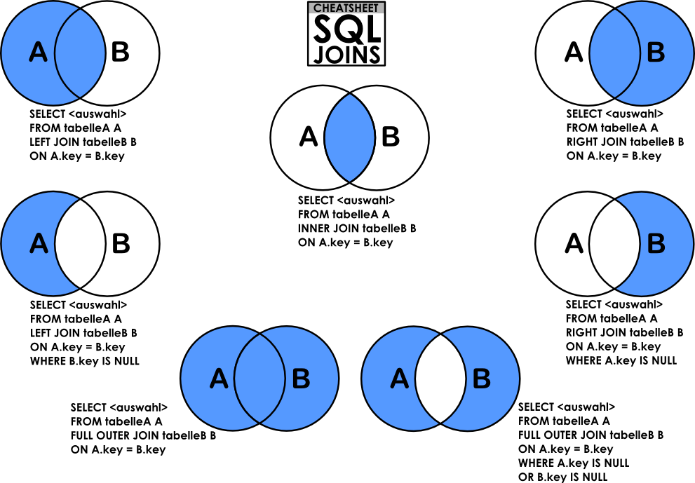

# SQL - More Queries


## Project Overview

- **Level**: Amateur
- **Weight**: 1
- **Your score will be updated as you progress.**
- **Manual QA review must be done (request it when you are done with the project).**

### Description
This project focuses on advanced SQL queries and database management techniques, allowing you to deepen your understanding of relational databases and SQL operations.

### Resources
Read or watch the following materials to enhance your understanding:

- [How To Create a New User and Grant Permissions in MySQL](https://www.digitalocean.com/community/tutorials/how-to-create-a-new-user-and-grant-permissions-in-mysql)
- [How To Use MySQL GRANT Statement To Grant Privileges To a User](https://www.digitalocean.com/community/tutorials/how-to-use-mysql-grant-statement-to-grant-privileges-to-a-user)
- [MySQL Constraints](https://dev.mysql.com/doc/refman/8.0/en/constraints.html)
- [SQL Technique: Subqueries](https://www.w3schools.com/sql/sql_subqueries.asp)
- [Basic Query Operation: The Join](https://www.w3schools.com/sql/sql_join.asp)
- [SQL Technique: Multiple Joins and the Distinct Keyword](https://dev.mysql.com/doc/refman/8.0/en/join.html)
- [SQL Technique: Join Types](https://www.w3schools.com/sql/sql_join_types.asp)
- [SQL Technique: Union and Minus](https://www.w3schools.com/sql/sql_union.asp)
- [MySQL Cheat Sheet](https://www.mysqltutorial.org/mysql-cheat-sheet/)
- [The Seven Types of SQL Joins](https://www.javatpoint.com/sql-join)
- [MySQL Tutorial](https://www.mysqltutorial.org/)
- [SQL Style Guide](https://www.sqlstyle.guide/)
- [MySQL 8.0 SQL Statement Syntax](https://dev.mysql.com/doc/refman/8.0/en/sql-syntax.html)

#### Extra Resources around Relational Database Model Design:
- [Design](https://www.lucidchart.com/pages/database-design)
- [Normalization](https://www.guru99.com/database-normalization.html)
- [ER Modeling](https://www.guru99.com/er-diagram-tutorial.html)

### Learning Objectives
By the end of this project, you should be able to explain the following concepts without assistance:

- How to create a new MySQL user
- How to manage privileges for a user to a database or table
- What a PRIMARY KEY is
- What a FOREIGN KEY is
- How to use NOT NULL and UNIQUE constraints
- How to retrieve data from multiple tables in one request
- What subqueries are
- What JOIN and UNION operations are

### Describe concept:
Here’s an overview of these `MySQL concepts and operations`:

1. How to Create a `New MySQL User`

- To create a new user in MySQL, use the following command
```sql
CREATE USER 'username'@'hostname' IDENTIFIED BY 'password';
```
- Replace `username` with the desired username, `hostname` with the server (usually `localhost`), and `password` with the user’s password. You can replace localhost with `%` to allow access from any host.

2. How to `Manage Privileges` for a User to a Database or Table

- Use the `GRANT` command to assign specific privileges to a user:
```sql
GRANT ALL PRIVILEGES ON database_name.* TO 'username'@'hostname';
```
- Replace `database_name` with the name of the database and username with the MySQL username. To apply changes:
```sql
FLUSH PRIVILEGES;
```

3. What’s a `PRIMARY KEY`?

- `A primary key is a column (or combination of columns) in a table that uniquely identifies each row in that table`. It cannot contain `NULL` values and must be unique across the table.

   - PRIMARY KEY:

      - A primary key uniquely identifies each record in a table. It ensures that each row in the table is unique and does not allow NULL values.
Example:
```sql
CREATE TABLE employees (
  employee_id INT PRIMARY KEY,
  first_name VARCHAR(50),
  last_name VARCHAR(50)
);
```
   - Here, employee_id is the primary key, uniquely identifying each employee.

4. What’s a `FOREIGN KEY`?

- `A foreign key is a column (or combination of columns) that links records in one table to the primary key in another table, establishing a relationship between the two tables`. It enforces referential integrity.

   - FOREIGN KEY:

      - A foreign key in one table links to a primary key in another table. This establishes a relationship between the two tables, enforcing referential integrity (i.e., it ensures that a value in the foreign key column exists in the primary key column of the related table).

      - Example:
```sql
CREATE TABLE departments (
  department_id INT PRIMARY KEY,
  department_name VARCHAR(50)
);

CREATE TABLE employees (
  employee_id INT PRIMARY KEY,
  first_name VARCHAR(50),
  last_name VARCHAR(50),
  department_id INT,
  FOREIGN KEY (department_id) REFERENCES departments(department_id)
);
```
      - Here, the department_id in the employees table is a foreign key that links to the department

5. How to Use `NOT NULL` and `UNIQUE` Constraints

- `NOT NULL`: Ensures a column cannot contain `NULL` values
```sql
CREATE TABLE example (
  column1 INT NOT NULL
);
```

- `UNIQUE`: Ensures all values in a column are unique.
```sql
CREATE TABLE example (
  column1 INT UNIQUE
);
```

6. How to Retrieve `Data from Multiple Tables` in One Request

- You can retrieve data from multiple tables using `JOIN` statements (`INNER JOIN`, `LEFT JOIN`, `RIGHT JOIN`) to combine rows based on related columns.
- Example with `INNER JOIN`
```sql
SELECT a.column1, b.column2
FROM table1 a
INNER JOIN table2 b ON a.common_column = b.common_column;
```

7. What are `Subqueries`?

- A `subquery is a query within another query`, used to return data that will be used by the main query.
```sql
SELECT column1
FROM table1
WHERE column2 = (SELECT column2 FROM table2 WHERE condition);
```

8. What are `JOIN` and `UNION`?

- `JOIN`: Combines rows from two or more tables based on a related column. Types of joins include:

   - `INNER JOIN`: Returns rows with matching values in both tables.

   - `LEFT JOIN`: Returns all rows from the left table and matching rows from the right table (or `NULL` if no match).

   - `RIGHT JOIN`: Returns all rows from the right table and matching rows from the left table (or `NULL` if no match).

   - `FULL OUTER JOIN`: Returns rows when there’s a match in either table (not always supported in MySQL).
- Exemple
```sql
SELECT a.column1, b.column2
FROM table1 a
LEFT JOIN table2 b ON a.common_column = b.common_column;
```

- `UNION`: Combines the results of two or more `SELECT` statements, returning all distinct rows.

```sql
SELECT column1 FROM table1
UNION
SELECT column1 FROM table2;
```

## Requirements
### General
- Allowed editors: `vi`, `vim`, `emacs`
- All your files will be executed on Ubuntu 20.04 LTS using MySQL 8.0 (version 8.0.25)
- All your files should end with a new line
- Each SQL query should have a comment just before it
- Each file should start with a comment describing the task
- All SQL keywords should be in uppercase (e.g., `SELECT`, `WHERE`)
- A `README.md` file is mandatory at the root of the project folder
- The length of your files will be tested using `wc`

### Comments for Your SQL File:
```sql
-- 3 first students in the Batch ID=3
-- because Batch 3 is the best!
SELECT id, name FROM students WHERE batch_id = 3 ORDER BY created_at DESC LIMIT 3;
```

### Install MySQL 8.0 on Ubuntu 20.04 LTS:
NOTE: If you’re using the provided sandbox, you don’t need to install MySQL. Skip to the next section.
```bash
$ sudo apt update
$ sudo apt install mysql-server
$ mysql --version
```

### Connect to Your MySQL Server:
```bash
$ sudo mysql
```

### Use the Sandbox to Run MySQL
In the container, credentials are root/root.

Request a container with Ubuntu 20.04.
Connect via SSH or the Web terminal.
Start MySQL before playing with it:
```bash
$ service mysql start
```

### How to import a SQL Dump
```bash
$ echo "CREATE DATABASE hbtn_0d_tvshows;" | mysql -uroot -p
$ curl "https://s3.eu-west-3.amazonaws.com/hbtn.intranet.project.files/holbertonschool-higher-level_programming+/274/hbtn_0d_tvshows.sql" -s | mysql -uroot -p hbtn_0d_tvshows
$ echo "SELECT * FROM tv_genres" | mysql -uroot -p hbtn_0d_tvshows
```



### Tasks
0. **My Privileges!**
   - Write a script that lists all privileges of the MySQL users `user_0d_1` and `user_0d_2` on your server (in localhost).

1. **Root User**
   - Write a script that creates the MySQL server user `user_0d_1` with all privileges and a password set to `user_0d_1_pwd`.

2. **Read User**
   - Write a script that creates the database `hbtn_0d_2` and the user `user_0d_2`, granting only SELECT privileges.

3. **Always a Name**
   - Write a script that creates the table `force_name` on your MySQL server with specified columns.

4. **ID Can't Be Null**
   - Write a script that creates the table `id_not_null` with specified constraints.

5. **Unique ID**
   - Write a script that creates the table `unique_id` with unique constraints on the `id` column.

6. **States Table**
   - Write a script that creates the database `hbtn_0d_usa` and the table `states` with specified columns.

7. **Cities Table**
   - Write a script that creates the table `cities` in the `hbtn_0d_usa` database, including a foreign key reference.

8. **Cities of California**
   - Write a script that lists all the cities of California in the database `hbtn_0d_usa`, sorted by city ID without using JOIN.

9. **Cities by States**
   - Write a script that lists all cities contained in the database `hbtn_0d_usa`, displaying `cities.id`, `cities.name`, and `states.name`, sorted by `cities.id`.

10. **Genre ID by Show**
    - Write a script that lists all shows in the database `hbtn_0d_tvshows` that have at least one genre linked, displaying `tv_shows.title` and `tv_show_genres.genre_id`, sorted by both.

11. **Genre ID for All Shows**
    - Write a script that lists all shows in the database `hbtn_0d_tvshows`, displaying `tv_shows.title` and `tv_show_genres.genre_id`, including shows without genres.

12. **No Genre**
    - Write a script that lists all shows in the database `hbtn_0d_tvshows` without a genre linked, displaying `tv_shows.title` and `tv_show_genres.genre_id`.

13. **Number of Shows by Genre**
    - Write a script that lists all genres from `hbtn_0d_tvshows` and the number of shows linked to each, displaying the genre and number of shows, sorted by the number of shows.

14. **My Genres**
    - Write a script that lists all genres of the show "Dexter" from the `hbtn_0d_tvshows` database, displaying `tv_genres.name`, sorted by genre name.

15. **Only Comedy**
    - Write a script that lists all Comedy shows in the database `hbtn_0d_tvshows`, displaying `tv_shows.title`, sorted by show title.

16. **List Shows and Genres**
    - Write a script that lists all shows and all genres linked to that show from the database `hbtn_0d_tvshows`, displaying `tv_shows.title` and `tv_genres.name`, sorted by both.


# Tasks

## 0. My Privileges!

Write a script that lists all privileges of the MySQL users `user_0d_1` and `user_0d_2` on your server (in localhost).
```bash
cat 0-privileges.sql | mysql -hlocalhost -uroot -p
Enter password:
ERROR 1141 (42000) at line 3: There is no such grant defined for user 'user_0d_1' on host 'localhost'
guillaume@ubuntu:~/$
guillaume@ubuntu:~/$ echo "CREATE USER 'user_0d_1'@'localhost';" |  mysql -hlocalhost -uroot -p
Enter password:
guillaume@ubuntu:~/$ echo "GRANT ALL PRIVILEGES ON *.* TO 'user_0d_1'@'localhost';" |  mysql -hlocalhost -uroot -p
Enter password:
guillaume@ubuntu:~/$ cat 0-privileges.sql | mysql -hlocalhost -uroot -p
Enter password:
Grants for user_0d_1@localhost
GRANT SELECT, INSERT, UPDA..., DROP ROLE ON *.* TO `user_0d_1`@`localhost`
GRANT APPLICATION_PASSWORD_ADMIN,AUDIT...,XA_RECOVER_ADMIN ON *.* TO `user_0d_1`@`localhost`
ERROR 1141 (42000) at line 4: There is no such grant defined for user 'user_0d_2' on host 'localhost'
guillaume@ubuntu:~/$
```
Repo:

GitHub repository: `holbertonschool-higher_level_programming`

Directory: `SQL_more_queries`

File: `0-privileges.sql`


```sql
-- Task0:
-- Create users if they do not exist
CREATE USER IF NOT EXISTS 'user_0d_1'@'localhost';
-- CREATE USER IF NOT EXISTS 'user_0d_2'@'localhost';
-- CREATE USER 'user_0d_1'@'localhost';
-- CREATE USER 'user_0d_2'@'localhost';

-- Grant privileges to each user if they don't have any (adjust privileges if necessary)
GRANT ALL PRIVILEGES ON *.* TO 'user_0d_1'@'localhost';
-- GRANT ALL PRIVILEGES ON *.* TO 'user_0d_2'@'localhost';
-- GRANT SELECT ON *.* TO 'user_0d_2'@'localhost'; -- Adjust as necessary

-- Apply the changes
FLUSH PRIVILEGES;

-- Show privileges for each user
SHOW GRANTS FOR 'user_0d_1'@'localhost';
SHOW GRANTS FOR 'user_0d_2'@'localhost';

-- Apply the changes
-- FLUSH PRIVILEGES;
```


## 1. Root user

Write a script that creates the MySQL server user `user_0d_1`.

- `user_0d_1` should have all privileges on your MySQL server
- The `user_0d_1` password should be set to `user_0d_1_pwd`
- If the user `user_0d_1` already exists, your script should not fail

```bash
guillaume@ubuntu:~/$ cat 1-create_user.sql | mysql -hlocalhost -uroot -p
Enter password:
guillaume@ubuntu:~/$ cat 0-privileges.sql | mysql -hlocalhost -uroot -p
Enter password:
Grants for user_0d_1@localhost
GRANT SELECT, INSERT..., DROP ROLE ON *.* TO `user_0d_1`@`localhost`
GRANT APPLICATION_PASSWORD_ADMIN,...,XA_RECOVER_ADMIN ON *.* TO `user_0d_1`@`localhost`
ERROR 1141 (42000) at line 4: There is no such grant defined for user 'user_0d_2' on host 'localhost'
guillaume@ubuntu:~/$
```

Repo:

GitHub repository: `holbertonschool-higher_level_programming`

Directory: `SQL_more_queries`

File: `1-create_user.sql`


```sql
-- Task 1:
-- Create user 'user_0d_1' with the specified password if it does not exist
CREATE USER IF NOT EXISTS 'user_0d_1'@'localhost' IDENTIFIED BY 'user_0d_1_pwd';

-- Grant all privileges to 'user_0d_1' on all databases
GRANT ALL PRIVILEGES ON *.* TO 'user_0d_1'@'localhost';

-- Apply the changes
FLUSH PRIVILEGES;
```


## 2. Read user

Write a script that creates the database `hbtn_0d_2` and the `user user_0d_2`.

- `user_0d_2` should have only SELECT privilege in the database `hbtn_0d_2`
- The `user_0d_2` password should be set to `user_0d_2_pwd`
- If the database `hbtn_0d_2` already exists, your script should not fail
- If the user `user_0d_2` already exists, your script should not fail

```bash
guillaume@ubuntu:~/$ cat 2-create_read_user.sql | mysql -hlocalhost -uroot -p
Enter password:
guillaume@ubuntu:~/$ cat 0-privileges.sql | mysql -hlocalhost -uroot -p
Enter password:
Grants for user_0d_1@localhost
GRANT SELECT, ..., DROP ROLE ON *.* TO `user_0d_1`@`localhost`
GRANT APPLICATION_PASSWORD_ADMIN,...,XA_RECOVER_ADMIN ON *.* TO `user_0d_1`@`localhost`
Grants for user_0d_2@localhost
GRANT USAGE ON *.* TO `user_0d_2`@`localhost`
GRANT SELECT ON `hbtn_0d_2`.* TO `user_0d_2`@`localhost`
guillaume@ubuntu:~/$
```
Repo:


GitHub repository: `holbertonschool-higher_level_programming`

Directory: `SQL_more_queries`

File: `2-create_read_user.sql`


```sql
-- Task 2:
-- Create the database 'hbtn_0d_2' if it does not exist
CREATE DATABASE IF NOT EXISTS hbtn_0d_2;

-- Create user 'user_0d_2' with the specified password if it does not exist
CREATE USER IF NOT EXISTS 'user_0d_2'@'localhost' IDENTIFIED BY 'user_0d_2_pwd';

-- Grant only SELECT privilege on the 'hbtn_0d_2' database to 'user_0d_2'
GRANT SELECT ON hbtn_0d_2.* TO 'user_0d_2'@'localhost';

-- Apply the changes
FLUSH PRIVILEGES;
```


### 3. Always a name

Write a script that creates the table `force_name` on your MySQL server.
- `force_name` description:
	- `id` INT
	`name` VARCHAR(256) can’t be null
The database name will be passed as an argument of the `mysql` command
If the table `force_name` already exists, your script should not fail.

```bash
guillaume@ubuntu:~/$ cat 3-force_name.sql | mysql -hlocalhost -uroot -p hbtn_0d_2
Enter password:
guillaume@ubuntu:~/$ echo 'INSERT INTO force_name (id, name) VALUES (89, "Best School");' | mysql -hlocalhost -uroot -p hbtn_0d_2
Enter password:
guillaume@ubuntu:~/$ echo 'SELECT * FROM force_name;' | mysql -hlocalhost -uroot -p hbtn_0d_2
Enter password:
id  name
89  Best School
guillaume@ubuntu:~/$ echo 'INSERT INTO force_name (id) VALUES (333);' | mysql -hlocalhost -uroot -p hbtn_0d_2
Enter password:
ERROR 1364 (HY000) at line 1: Field 'name' doesn't have a default value
guillaume@ubuntu:~/$ echo 'SELECT * FROM force_name;' | mysql -hlocalhost -uroot -p hbtn_0d_2
Enter password:
id  name
89  Best School
guillaume@ubuntu:~/$
```
Repo:

GitHub repository: `holbertonschool-higher_level_programming`

Directory: `SQL_more_queries`

File: `3-force_name.sql`


```sql
-- Task 3:
-- Create the table 'force_name' if it does not exist
CREATE TABLE IF NOT EXISTS force_name (
    id INT,
    name VARCHAR(256) NOT NULL
);
```


## 4. ID can't be null
Write a script that creates the table `id_not_null` on your MySQL server.
- `id_not_null` description:
	- `id` INT with the default value `1`
	- `name` VARCHAR(256)
- The database name will be passed as an argument of the `mysql` command
- If the table `id_not_null` already exists, your script should not fail

```bash
guillaume@ubuntu:~/$ cat 4-never_empty.sql | mysql -hlocalhost -uroot -p hbtn_0d_2
Enter password:
guillaume@ubuntu:~/$ echo 'INSERT INTO id_not_null (id, name) VALUES (89, "Best School");' | mysql -hlocalhost -uroot -p hbtn_0d_2
Enter password:
guillaume@ubuntu:~/$ echo 'SELECT * FROM id_not_null;' | mysql -hlocalhost -uroot -p hbtn_0d_2
Enter password:
id  name
89  Best School
guillaume@ubuntu:~/$ echo 'INSERT INTO id_not_null (name) VALUES ("Best");' | mysql -hlocalhost -uroot -p hbtn_0d_2
Enter password:
guillaume@ubuntu:~/$ echo 'SELECT * FROM id_not_null;' | mysql -hlocalhost -uroot -p hbtn_0d_2
Enter password:
id  name
89  Best School
1   Best
guillaume@ubuntu:~/$
```
Repo:

GitHub repository: `holbertonschool-higher_level_programming`

Directory: `SQL_more_queries`

File: `4-never_empty.sql`


```sql
-- Task 4:
-- Create the table 'id_not_null' if it does not exist
CREATE TABLE IF NOT EXISTS id_not_null (
    id INT DEFAULT 1,
    name VARCHAR(256)
);

```


## 5. Unique ID

Write a script that creates the table `unique_id` on your MySQL server.
- `unique_id` description:
	- `id` INT with the default value `1` and must be unique
	- `name` VARCHAR(256)
- The database name will be passed as an argument of the `mysql` command
- If the table `unique_id` already exists, your script should not fail
```bash
guillaume@ubuntu:~/$ cat 5-unique_id.sql | mysql -hlocalhost -uroot -p hbtn_0d_2
Enter password:
guillaume@ubuntu:~/$ echo 'INSERT INTO unique_id (id, name) VALUES (89, "Best School");' | mysql -hlocalhost -uroot -p hbtn_0d_2
Enter password:
guillaume@ubuntu:~/$ echo 'SELECT * FROM unique_id;' | mysql -hlocalhost -uroot -p hbtn_0d_2
Enter password:
id  name
89  Best School
guillaume@ubuntu:~/$ echo 'INSERT INTO unique_id (id, name) VALUES (89, "Best");' | mysql -hlocalhost -uroot -p hbtn_0d_2
Enter password:
ERROR 1062 (23000) at line 1: Duplicate entry '89' for key 'unique_id.id'
guillaume@ubuntu:~/$ echo 'SELECT * FROM unique_id;' | mysql -hlocalhost -uroot -p hbtn_0d_2
Enter password:
id  name
89  Best School
guillaume@ubuntu:~/$
```
Repo:

GitHub repository:
`holbertonschool-higher_level_programming`

Directory: `SQL_more_queries`

File: `5-unique_id.sql`


```sql
-- Task 5:
-- Create the table 'unique_id' if it does not exist
CREATE TABLE IF NOT EXISTS unique_id (
    id INT DEFAULT 1 UNIQUE,
    name VARCHAR(256)
);
```


## 6. States table

Write a script that creates the database `hbtn_0d_usa` and the table `states` (in the database `hbtn_0d_usa`) on your MySQL server.
- `states` description:
	- `id` INT unique, auto generated, can’t be null and is a primary key
	- `name` VARCHAR(256) can’t be null
- If the database `hbtn_0d_usa` already exists, your script should not fail
- If the table states already exists, your script should not fail
```bash
guillaume@ubuntu:~/$ cat 6-states.sql | mysql -hlocalhost -uroot -p
Enter password:
guillaume@ubuntu:~/$ echo 'INSERT INTO states (name) VALUES ("California"), ("Arizona"), ("Texas");' | mysql -hlocalhost -uroot -p hbtn_0d_usa
Enter password:
guillaume@ubuntu:~/$ echo 'SELECT * FROM states;' | mysql -hlocalhost -uroot -p hbtn_0d_usa
Enter password:
id  name
1   California
2   Arizona
3   Texas
guillaume@ubuntu:~/$
```
Repo:

GitHub repository: `holbertonschool-higher_level_programming`

Directory: `SQL_more_queries`

File: `6-states.sql`


```sql
-- Task 6:
-- Create the database if it does not exist
CREATE DATABASE IF NOT EXISTS hbtn_0d_usa;

-- Use the newly created or existing database
USE hbtn_0d_usa;

-- Create the table 'states' if it does not exist
CREATE TABLE IF NOT EXISTS states (
    id INT NOT NULL AUTO_INCREMENT,
    name VARCHAR(256) NOT NULL,
    PRIMARY KEY (id)
);
```


## 7. Cities table

Write a script that creates the database `hbtn_0d_usa` and the table `cities` (in the database `hbtn_0d_usa`) on your MySQL server.
- `cities` description:
	- `id` INT unique, auto generated, can’t be null and is a primary key
	- `state_id` INT, can’t be null and must be a `FOREIGN KEY` that references to `id` of the `states` table
	- `name` VARCHAR(256) can’t be null
- If the database `hbtn_0d_usa` already exists, your script should not fail
- If the table `cities` already exists, your script should not fail
```bash
guillaume@ubuntu:~/$ cat 7-cities.sql | mysql -hlocalhost -uroot -p
Enter password:
guillaume@ubuntu:~/$ echo 'INSERT INTO cities (state_id, name) VALUES (1, "San Francisco");' | mysql -hlocalhost -uroot -p hbtn_0d_usa
Enter password:
guillaume@ubuntu:~/$ echo 'SELECT * FROM cities;' | mysql -hlocalhost -uroot -p hbtn_0d_usa
Enter password:
id  state_id    name
1   1   San Francisco
guillaume@ubuntu:~/$ echo 'INSERT INTO cities (state_id, name) VALUES (10, "Paris");' | mysql -hlocalhost -uroot -p hbtn_0d_usa
Enter password:
ERROR 1452 (23000) at line 1: Cannot add or update a child row: a foreign key constraint fails (`hbtn_0d_usa`.`cities`, CONSTRAINT `cities_ibfk_1` FOREIGN KEY (`state_id`) REFERENCES `states` (`id`))
guillaume@ubuntu:~/$ echo 'SELECT * FROM cities;' | mysql -hlocalhost -uroot -p hbtn_0d_usa
Enter password:
id  state_id    name
1   1   San Francisco
guillaume@ubuntu:~/$
```
Repo:

GitHub repository: `holbertonschool-higher_level_programming`

Directory: `SQL_more_queries`

File: `7-cities.sql`


```sql
-- Task 7:
-- Create the database if it does not exist
CREATE DATABASE IF NOT EXISTS hbtn_0d_usa;

-- Use the newly created or existing database
USE hbtn_0d_usa;

-- Create the 'states' table if it doesn't exist to avoid foreign key constraint issues
CREATE TABLE IF NOT EXISTS states (
    id INT NOT NULL AUTO_INCREMENT,
    name VARCHAR(256) NOT NULL,
    PRIMARY KEY (id)
);

-- Create the 'cities' table if it does not exist
CREATE TABLE IF NOT EXISTS cities (
    id INT NOT NULL AUTO_INCREMENT,
    state_id INT NOT NULL,
    name VARCHAR(256) NOT NULL,
    PRIMARY KEY (id),
    FOREIGN KEY (state_id) REFERENCES states(id)
        ON DELETE CASCADE ON UPDATE CASCADE
);
```


## 8. Cities of California

Write a script that lists all the cities of California that can be found in the database `hbtn_0d_usa`.
- The `states` table contains only one record where `name = California` (but the `id` can be different, as per the example)
- Results must be sorted in ascending order by `cities.id`
- You are not allowed to use the `JOIN` keyword
- The database name will be passed as an argument of the `mysql` command
```bash
guillaume@ubuntu:~/$ echo 'SELECT * FROM states;' | mysql -hlocalhost -uroot -p hbtn_0d_usa
Enter password:
id  name
1   California
2   Arizona
3   Texas
4   Utah
guillaume@ubuntu:~/$ echo 'SELECT * FROM cities;' | mysql -hlocalhost -uroot -p hbtn_0d_usa
Enter password:
id  state_id    name
1   1   San Francisco
2   1   San Jose
4   2   Page
6   3   Paris
7   3   Houston
8   3   Dallas
guillaume@ubuntu:~/$ cat 8-cities_of_california_subquery.sql | mysql -hlocalhost -uroot -p hbtn_0d_usa
Enter password:
id  name
1   San Francisco
2   San Jose
guillaume@ubuntu:~/$
```
Repo:

GitHub repository: `holbertonschool-higher_level_programming`

Directory: `SQL_more_queries`

File: `8-cities_of_california_subquery.sql`


```sql
-- Task 8:
-- Select cities in California from the cities table based on the state_id of California from the states table
SELECT id, name
FROM cities
WHERE state_id = (SELECT id FROM states WHERE name = 'California')
ORDER BY id ASC;
```


## 9. Cities by States

Write a script that lists all cities contained in the database `hbtn_0d_usa`.
- Each record should display: `cities.id` - `cities.name` - `states.name`
- Results must be sorted in ascending order by `cities.id`
- You can use only one `SELECT` statement
- The database name will be passed as an argument of the `mysql` command
```bash
guillaume@ubuntu:~/$ echo 'SELECT * FROM states;' | mysql -hlocalhost -uroot -p hbtn_0d_usa
Enter password:
id  name
1   California
2   Arizona
3   Texas
4   Utah
guillaume@ubuntu:~/$ echo 'SELECT * FROM cities;' | mysql -hlocalhost -uroot -p hbtn_0d_usa
Enter password:
id  state_id    name
1   1   San Francisco
2   1   San Jose
4   2   Page
6   3   Paris
7   3   Houston
8   3   Dallas
guillaume@ubuntu:~/$ cat 9-cities_by_state_join.sql | mysql -hlocalhost -uroot -p hbtn_0d_usa
Enter password:
id  name    name
1   San Francisco   California
2   San Jose    California
4   Page    Arizona
6   Paris   Texas
7   Houston Texas
8   Dallas  Texas
guillaume@ubuntu:~/$
```
Repo:

GitHub repository: `holbertonschool-higher_level_programming`

Directory: `SQL_more_queries`

File: `9-cities_by_state_join.sql`


```sql
-- Task 9:
-- Select cities with their states from the cities and states tables using a JOIN on state_id
SELECT cities.id, cities.name, states.name
FROM cities
JOIN states ON cities.state_id = states.id
ORDER BY cities.id ASC;
```


## 10 Genre ID by show

Import the database dump from `hbtn_0d_tvshows` to your MySQL server: `download` --> https://s3.eu-west-3.amazonaws.com/hbtn.intranet.project.files/holbertonschool-higher-level_programming+/274/hbtn_0d_tvshows.sql

Write a script that lists all shows contained in `hbtn_0d_tvshows` that have at least one genre linked.
- Each record should display: `tv_shows.title` - `tv_show_genres.genre_id`
- Results must be sorted in ascending order by `tv_shows.title` and `tv_show_genres.genre_id`
- You can use only one `SELECT` statement
- The database name will be passed as an argument of the `mysql` command
```bash
guillaume@ubuntu:~/$ cat 10-genre_id_by_show.sql | mysql -hlocalhost -uroot -p hbtn_0d_tvshows
Enter password:
title   genre_id
Breaking Bad    1
Breaking Bad    6
Breaking Bad    7
Breaking Bad    8
Dexter  1
Dexter  2
Dexter  6
Dexter  7
Dexter  8
Game of Thrones 1
Game of Thrones 3
Game of Thrones 4
House   1
House   2
New Girl    5
Silicon Valley  5
The Big Bang Theory 5
The Last Man on Earth   1
The Last Man on Earth   5
guillaume@ubuntu:~/$
```
Repo:

GitHub repository: `holbertonschool-higher_level_programming`

Directory: ``SQL_more_queries`

File: `10-genre_id_by_show.sql`


```sql
-- Task 10:
-- Select titles and genre IDs for shows that have linked genres
SELECT tv_shows.title, tv_show_genres.genre_id
FROM tv_shows
JOIN tv_show_genres ON tv_shows.id = tv_show_genres.show_id
ORDER BY tv_shows.title ASC, tv_show_genres.genre_id ASC;
```


## 11. Genre ID for all shows

Import the database dump of `hbtn_0d_tvshows` to your MySQL server: `download` (same as `10-genre_id_by_show.sql`)

Write a script that lists all shows contained in the database `hbtn_0d_tvshows`.
- Each record should display: `tv_shows.title` - `tv_show_genres.genre_id`
- Results must be sorted in ascending order by `tv_shows.title` and `tv_show_genres.genre_id`
- If a show doesn’t have a genre, display `NULL`
- You can use only one `SELECT` statement
- The database name will be passed as an argument of the `mysql` command
```bash
guillaume@ubuntu:~/$ cat 11-genre_id_all_shows.sql | mysql -hlocalhost -uroot -p hbtn_0d_tvshows
Enter password:
title   genre_id
Better Call Saul    NULL
Breaking Bad    1
Breaking Bad    6
Breaking Bad    7
Breaking Bad    8
Dexter  1
Dexter  2
Dexter  6
Dexter  7
Dexter  8
Game of Thrones 1
Game of Thrones 3
Game of Thrones 4
Homeland    NULL
House   1
House   2
New Girl    5
Silicon Valley  5
The Big Bang Theory 5
The Last Man on Earth   1
The Last Man on Earth   5
guillaume@ubuntu:~/$
```
Repo:

GitHub repository: `holbertonschool-higher_level_programming`

Directory: `SQL_more_queries`

File: `11-genre_id_all_shows.sql`


```sql
-- Task 11:
-- Select titles and genre IDs for all shows, displaying NULL for shows without genres
SELECT tv_shows.title, tv_show_genres.genre_id
FROM tv_shows
LEFT JOIN tv_show_genres ON tv_shows.id = tv_show_genres.show_id
ORDER BY tv_shows.title ASC, tv_show_genres.genre_id ASC;
```


## 12. No genre

Import the database dump from `hbtn_0d_tvshows` to your MySQL server: `download` (same as `11-genre_id_all_shows.sql` --> https://s3.eu-west-3.amazonaws.com/hbtn.intranet.project.files/holbertonschool-higher-level_programming+/274/hbtn_0d_tvshows.sql)
Write a script that lists all shows contained in `hbtn_0d_tvshows` without a genre linked.
- Each record should display: `tv_shows.title - tv_show_genres.genre_id`
- Results must be sorted in ascending order by `tv_shows.title` and `tv_show_genres.genre_id`
- You can use only one `SELECT`` statement
- The database name will be passed as an argument of the `mysql` command
```bash
guillaume@ubuntu:~/$ cat 12-no_genre.sql | mysql -hlocalhost -uroot -p hbtn_0d_tvshows
Enter password:
title   genre_id
Better Call Saul    NULL
Homeland    NULL
guillaume@ubuntu:~/$
```
Repo:

GitHub repository: `holbertonschool-higher_level_programming`

Directory: `SQL_more_queries`

File: `12-no_genre.sql`


```sql
-- Task 12:
-- Select titles of shows without a linked genre
SELECT tv_shows.title, tv_show_genres.genre_id
FROM tv_shows
LEFT JOIN tv_show_genres ON tv_shows.id = tv_show_genres.show_id
WHERE tv_show_genres.genre_id IS NULL
ORDER BY tv_shows.title ASC;
```


## 13. Number of shows by genre

Import the database dump from `hbtn_0d_tvshows` to your MySQL server: `download` (same as `12-no_genre.sql` --> https://s3.eu-west-3.amazonaws.com/hbtn.intranet.project.files/holbertonschool-higher-level_programming+/274/hbtn_0d_tvshows.sql)

Write a script that lists all genres from `hbtn_0d_tvshows` and displays the number of shows linked to each.
- Each record should display: `<TV Show genre>` - `<Number of shows linked to this genre>`
- First column must be called `genre`
- Second column must be called `number_of_shows`
- Don’t display a genre that doesn’t have any shows linked
- Results must be sorted in descending order by the number of shows linked
- You can use only one `SELECT` statement
- The database name will be passed as an argument of the `mysql` command
```bash
guillaume@ubuntu:~/$ cat 13-count_shows_by_genre.sql | mysql -hlocalhost -uroot -p hbtn_0d_tvshows
Enter password:
genre   number_of_shows
Drama   5
Comedy  4
Mystery 2
Crime   2
Suspense    2
Thriller    2
Adventure   1
Fantasy 1
guillaume@ubuntu:~/$
```
Repo:

GitHub repository: `holbertonschool-higher_level_programming`

Directory: `SQL_more_queries`

File: `13-count_shows_by_genre.sql`


```sql
-- Task 13:
-- Count the number of shows linked to each genre
SELECT tv_genres.name AS genre, COUNT(tv_show_genres.show_id) AS number_of_shows
FROM tv_genres
JOIN tv_show_genres ON tv_genres.id = tv_show_genres.genre_id
GROUP BY tv_genres.name
HAVING number_of_shows > 0
ORDER BY number_of_shows DESC;
```


## 14. My genres

Import the database dump from `hbtn_0d_tvshows` to your MySQL server: `download` (same as `13-count_shows_by_genre.sql`)

Write a script that uses the `hbtn_0d_tvshows` database to lists all genres of the show `Dexter`.
- The `tv_shows` table contains only one record where `title` = `Dexter` (but the `id` can be different)
- Each record should display: `tv_genres.name`
- Results must be sorted in ascending order by the genre name
- You can use only one `SELECT` statement
- The database name will be passed as an argument of the `mysql` command
```bash
guillaume@ubuntu:~/$ cat 14-my_genres.sql | mysql -hlocalhost -uroot -p hbtn_0d_tvshows
Enter password:
name
Crime
Drama
Mystery
Suspense
Thriller
guillaume@ubuntu:~/$
```
Repo:

GitHub repository: `holbertonschool-higher_level_programming`

Directory: `SQL_more_queries`

File: `14-my_genres.sql`


```sql
-- Task 14:
-- List all genres of the show 'Dexter'
SELECT tv_genres.name
FROM tv_shows
JOIN tv_show_genres ON tv_shows.id = tv_show_genres.show_id
JOIN tv_genres ON tv_show_genres.genre_id = tv_genres.id
WHERE tv_shows.title = 'Dexter'
ORDER BY tv_genres.name ASC;
```


## 15. Only Comedy

Import the database dump from `hbtn_0d_tvshows` to your MySQL server: `download` (same as `14-my_genres.sql`)

Write a script that lists all Comedy shows in the database `hbtn_0d_tvshows`.
- The `tv_genres` table contains only one record where `name` = `Comedy` (but the `id` can be different)
- Each record should display: `tv_shows.title`
- Results must be sorted in ascending order by the show title
- You can use only one `SELECT` statement
- The database name will be passed as an argument of the `mysql` command
```bash
guillaume@ubuntu:~/$ cat 15-comedy_only.sql | mysql -hlocalhost -uroot -p hbtn_0d_tvshows
Enter password:
title
New Girl
Silicon Valley
The Big Bang Theory
The Last Man on Earth
guillaume@ubuntu:~/$
```
Repo:

GitHub repository: `holbertonschool-higher_level_programming`

Directory: `SQL_more_queries`

File: `15-comedy_only.sql`


```sql
-- Task 15:
-- List all Comedy shows
SELECT tv_shows.title
FROM tv_shows
JOIN tv_show_genres ON tv_shows.id = tv_show_genres.show_id
JOIN tv_genres ON tv_show_genres.genre_id = tv_genres.id
WHERE tv_genres.name = 'Comedy'
ORDER BY tv_shows.title ASC;
```


## 16. List shows and genres

Import the database dump from `hbtn_0d_tvshows` to your MySQL server: `download` (same as `15-comedy_only.sql`)

Write a script that lists all shows, and all genres linked to that show, from the database `hbtn_0d_tvshows`.

If a show doesn’t have a genre, display `NULL` in the genre column
Each record should display: `tv_shows.title` - `tv_genres.name`
Results must be sorted in ascending order by the show title and genre name
You can use only one `SELECT` statement
The database name will be passed as an argument of the `mysql` command
```bash
guillaume@ubuntu:~/$ cat 16-shows_by_genre.sql | mysql -hlocalhost -uroot -p hbtn_0d_tvshows
Enter password:
title   name
Better Call Saul    NULL
Breaking Bad    Crime
Breaking Bad    Drama
Breaking Bad    Suspense
Breaking Bad    Thriller
Dexter  Crime
Dexter  Drama
Dexter  Mystery
Dexter  Suspense
Dexter  Thriller
Game of Thrones Adventure
Game of Thrones Drama
Game of Thrones Fantasy
Homeland    NULL
House   Drama
House   Mystery
New Girl    Comedy
Silicon Valley  Comedy
The Big Bang Theory Comedy
The Last Man on Earth   Comedy
The Last Man on Earth   Drama
guillaume@ubuntu:~/$
```
Repo:

GitHub repository: `holbertonschool-higher_level_programming`

Directory: `SQL_more_queries`

File: `16-shows_by_genre.sql`


```sql
-- Task 16:
-- List all shows with their linked genres
SELECT tv_shows.title, tv_genres.name
FROM tv_shows
LEFT JOIN tv_show_genres ON tv_shows.id = tv_show_genres.show_id
LEFT JOIN tv_genres ON tv_show_genres.genre_id = tv_genres.id
ORDER BY tv_shows.title ASC, tv_genres.name ASC;
```

hbtn_0d_tvshows:
Download:
https://s3.eu-west-3.amazonaws.com/hbtn.intranet.project.files/holbertonschool-higher-level_programming+/274/hbtn_0d_tvshows.sql

```bash
-- MySQL dump 10.13  Distrib 5.7.8-rc, for Linux (x86_64)
--
-- Host: localhost    Database: hbtn_0d_tvshows
-- ------------------------------------------------------
-- Server version	5.7.8-rc

/*!40101 SET @OLD_CHARACTER_SET_CLIENT=@@CHARACTER_SET_CLIENT */;
/*!40101 SET @OLD_CHARACTER_SET_RESULTS=@@CHARACTER_SET_RESULTS */;
/*!40101 SET @OLD_COLLATION_CONNECTION=@@COLLATION_CONNECTION */;
/*!40101 SET NAMES utf8 */;
/*!40103 SET @OLD_TIME_ZONE=@@TIME_ZONE */;
/*!40103 SET TIME_ZONE='+00:00' */;
/*!40014 SET @OLD_UNIQUE_CHECKS=@@UNIQUE_CHECKS, UNIQUE_CHECKS=0 */;
/*!40014 SET @OLD_FOREIGN_KEY_CHECKS=@@FOREIGN_KEY_CHECKS, FOREIGN_KEY_CHECKS=0 */;
/*!40101 SET @OLD_SQL_MODE=@@SQL_MODE, SQL_MODE='NO_AUTO_VALUE_ON_ZERO' */;
/*!40111 SET @OLD_SQL_NOTES=@@SQL_NOTES, SQL_NOTES=0 */;

--
-- Table structure for table `tv_genres`
--

DROP TABLE IF EXISTS `tv_genres`;
/*!40101 SET @saved_cs_client     = @@character_set_client */;
/*!40101 SET character_set_client = utf8 */;
CREATE TABLE `tv_genres` (
  `id` int(11) NOT NULL AUTO_INCREMENT,
  `name` varchar(256) NOT NULL,
  PRIMARY KEY (`id`)
) ENGINE=InnoDB AUTO_INCREMENT=9 DEFAULT CHARSET=latin1;
/*!40101 SET character_set_client = @saved_cs_client */;

--
-- Dumping data for table `tv_genres`
--

LOCK TABLES `tv_genres` WRITE;
/*!40000 ALTER TABLE `tv_genres` DISABLE KEYS */;
INSERT INTO `tv_genres` VALUES (1,'Drama'),(2,'Mystery'),(3,'Adventure'),(4,'Fantasy'),(5,'Comedy'),(6,'Crime'),(7,'Suspense'),(8,'Thriller');
/*!40000 ALTER TABLE `tv_genres` ENABLE KEYS */;
UNLOCK TABLES;

--
-- Table structure for table `tv_show_genres`
--

DROP TABLE IF EXISTS `tv_show_genres`;
/*!40101 SET @saved_cs_client     = @@character_set_client */;
/*!40101 SET character_set_client = utf8 */;
CREATE TABLE `tv_show_genres` (
  `show_id` int(11) NOT NULL,
  `genre_id` int(11) NOT NULL,
  KEY `show_id` (`show_id`),
  KEY `genre_id` (`genre_id`),
  CONSTRAINT `tv_show_genres_ibfk_1` FOREIGN KEY (`show_id`) REFERENCES `tv_shows` (`id`),
  CONSTRAINT `tv_show_genres_ibfk_2` FOREIGN KEY (`genre_id`) REFERENCES `tv_genres` (`id`)
) ENGINE=InnoDB DEFAULT CHARSET=latin1;
/*!40101 SET character_set_client = @saved_cs_client */;

--
-- Dumping data for table `tv_show_genres`
--

LOCK TABLES `tv_show_genres` WRITE;
/*!40000 ALTER TABLE `tv_show_genres` DISABLE KEYS */;
INSERT INTO `tv_show_genres` VALUES (1,1),(1,2),(2,3),(2,1),(2,4),(3,5),(4,5),(5,5),(6,6),(6,1),(6,7),(6,8),(8,6),(8,1),(8,2),(8,7),(8,8),(10,5),(10,1);
/*!40000 ALTER TABLE `tv_show_genres` ENABLE KEYS */;
UNLOCK TABLES;

--
-- Table structure for table `tv_shows`
--

DROP TABLE IF EXISTS `tv_shows`;
/*!40101 SET @saved_cs_client     = @@character_set_client */;
/*!40101 SET character_set_client = utf8 */;
CREATE TABLE `tv_shows` (
  `id` int(11) NOT NULL AUTO_INCREMENT,
  `title` varchar(256) NOT NULL,
  PRIMARY KEY (`id`)
) ENGINE=InnoDB AUTO_INCREMENT=11 DEFAULT CHARSET=latin1;
/*!40101 SET character_set_client = @saved_cs_client */;

--
-- Dumping data for table `tv_shows`
--

LOCK TABLES `tv_shows` WRITE;
/*!40000 ALTER TABLE `tv_shows` DISABLE KEYS */;
INSERT INTO `tv_shows` VALUES (1,'House'),(2,'Game of Thrones'),(3,'The Big Bang Theory'),(4,'New Girl'),(5,'Silicon Valley'),(6,'Breaking Bad'),(7,'Better Call Saul'),(8,'Dexter'),(9,'Homeland'),(10,'The Last Man on Earth');
/*!40000 ALTER TABLE `tv_shows` ENABLE KEYS */;
UNLOCK TABLES;
/*!40103 SET TIME_ZONE=@OLD_TIME_ZONE */;

/*!40101 SET SQL_MODE=@OLD_SQL_MODE */;
/*!40014 SET FOREIGN_KEY_CHECKS=@OLD_FOREIGN_KEY_CHECKS */;
/*!40014 SET UNIQUE_CHECKS=@OLD_UNIQUE_CHECKS */;
/*!40101 SET CHARACTER_SET_CLIENT=@OLD_CHARACTER_SET_CLIENT */;
/*!40101 SET CHARACTER_SET_RESULTS=@OLD_CHARACTER_SET_RESULTS */;
/*!40101 SET COLLATION_CONNECTION=@OLD_COLLATION_CONNECTION */;
/*!40111 SET SQL_NOTES=@OLD_SQL_NOTES */;

-- Dump completed on 2017-02-26 20:57:02
```
